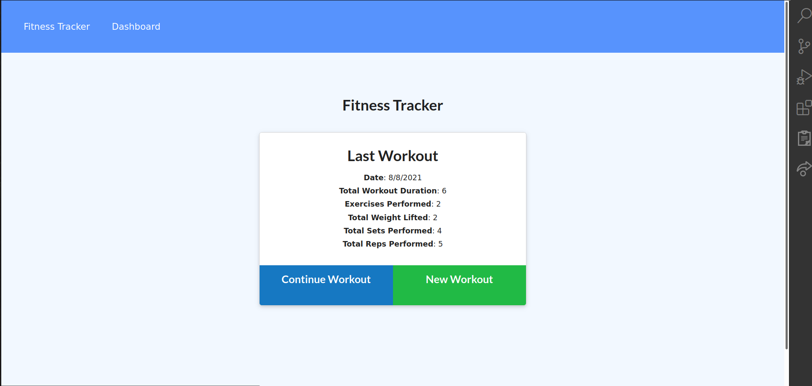
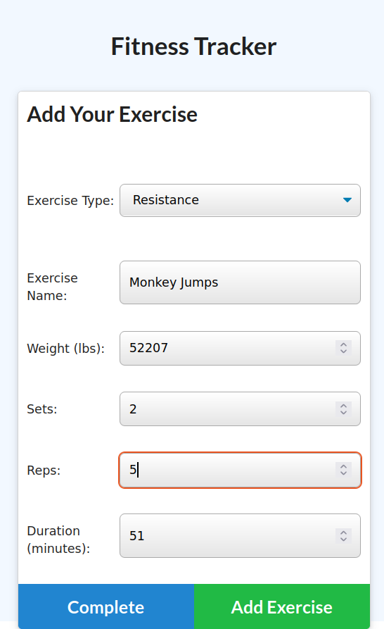

  <h1 align="center">FitLog 🎉 </h1>
    
   
  
  ## 👇  Description  👇
---
  
  A fitness tracker application which leverages NodeJS, Express, Mongoose (MongoDB). 
 
  ## Table of Contents 
  - [Description](#--description--)
  - [Installation Instructions 📣](#installation-instructions-)
  - [Usage 🖱️](#usage-️)
  - [Contributors 🧑‍🤝‍🧑](#contributors-)
  - [Screenshots 📷](#screenshots-)
  - [Questions ❔](#questions-)
  - [License ©️](#license-️)
    
  ## Installation Instructions 📣
---

  Clone Repo, run `npm i`, run `node server.js` visit url (likely,`https://localhost:3000`).
  
  ## Usage 🖱️
---

  Track your workouts. . . 
  
  ## Contributors 🧑‍🤝‍🧑
---
  Peter Roto
  
  ## Screenshots 📷
---

  |  Screenshot                              | Screenshot                               | Screenshot                               | 
  |:------------------------------------------------------:|:------------------------------------------------------:|:------------------------------------------------------:|
  |  |||
  |                                                        |                                                        |                                                        |
  |                                                        |                                                        |                                                        |   

  ## Questions ❔

---

  Email me, or create an issue on this repo. 
   
  :octocat: Find me on GitHub: [PROTO133](https://github.com/PROTO133) 
   
  📬 Email me with any questions: support@peterroto.com  
  
  ## License 
---
   
  This application is covered by <a href="https://opensource.org/licenses/MIT"> the MIT License</a> license. 

  --------------------------- 
 

  This README was generated with [writemeREADME](https://github.com/proto133/writemeREADME) 
  
